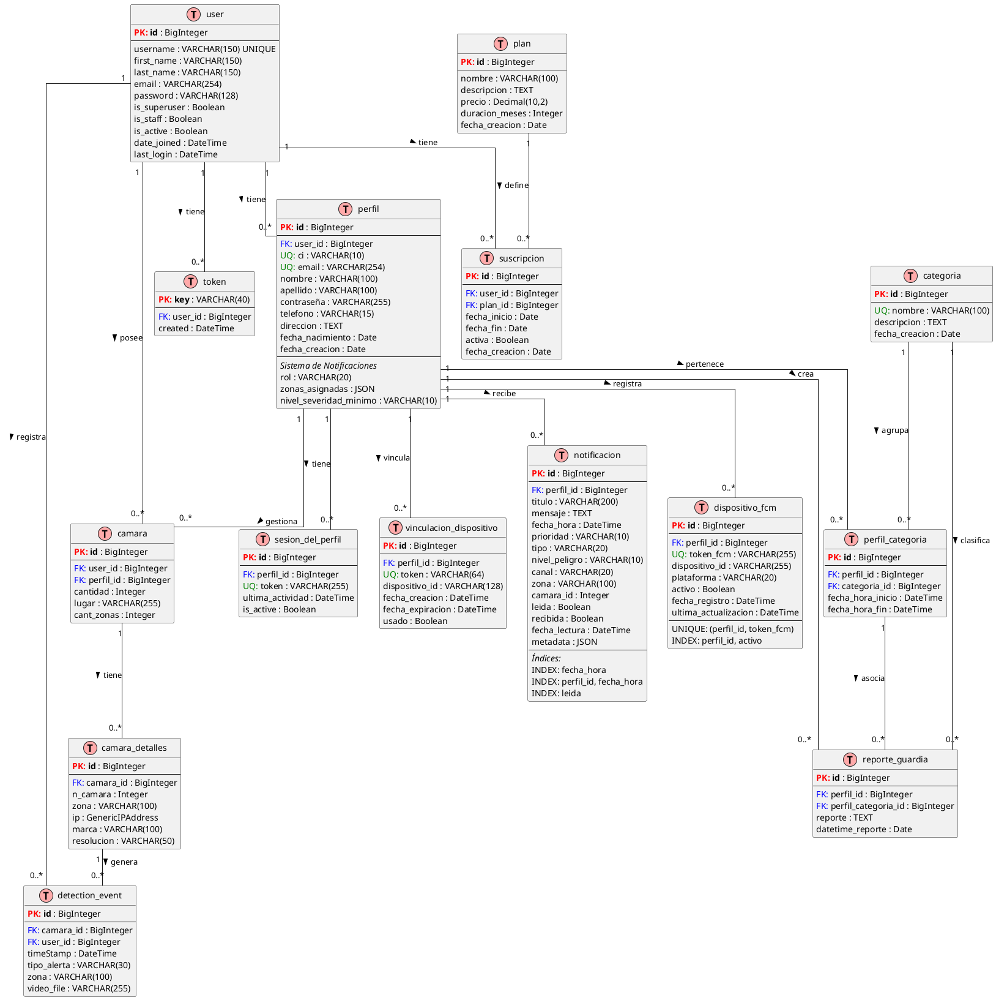

# 🔐 Visual Safety - Sistema de Detección de Violencia y Armas

Sistema inteligente de seguridad que utiliza visión artificial y deep learning para detectar violencia y armas en espacios públicos mediante cámaras IP/RTSP en tiempo real.

## 🚀 Instrucciones para Correr el Proyecto

### Paso 1: Levantar Backend con Docker
```bash
docker compose up --build
```

### Paso 2: Instalar Dependencias del Frontend
```bash
cd .\frontend\
npm install
```

### Paso 3: Ejecutar Aplicación Electron
```bash
npm run electron:dev
```

¡Listo! 🎉

---

## 📊 Diagrama de Base de Datos

El sistema utiliza PostgreSQL con las siguientes tablas y relaciones:



---

## 📋 Descripción de Módulos

### 🔐 **user** (Django Auth)
Sistema de autenticación por defecto de Django. Gestiona usuarios, contraseñas, permisos y tokens de autenticación.

### 👤 **perfil**
Gestión extendida de usuarios con roles (Guardia/Jefe de Seguridad), zonas asignadas y configuración de notificaciones.

### 💳 **suscripcion**
Sistema de planes y suscripciones para el servicio. Control de pagos y vigencia.

### 📹 **camaras**
Gestión de cámaras IP/RTSP. Incluye ubicación, zonas, detalles técnicos (IP, marca, resolución).

### 🤖 **ia_detection**
Registro de eventos detectados por el modelo de IA (violencia, armas). Almacena timestamp, tipo de alerta y video.

### 🔔 **notificaciones**
Sistema completo de notificaciones multicanal (Push, WebSocket, SMS, Email). Filtrado por prioridad, zona y nivel de peligro.

### 📝 **reporte**
Informes generados por guardias de seguridad sobre incidentes y alertas.

---

## 🛠️ Stack Tecnológico

### Backend
- **Django 5.2.1** - Framework web
- **Django REST Framework** - API RESTful
- **Daphne + Channels** - WebSockets
- **Celery + Redis** - Tareas asíncronas
- **PostgreSQL 15** - Base de datos

### Frontend
- **React 19.1.1** - UI Framework
- **Vite** - Build tool
- **Electron** - Aplicación de escritorio
- **TailwindCSS** - Estilos

### IA/ML
- **PyTorch** - Deep Learning
- **MobileNetV3** - Feature extraction
- **LSTM Bidireccional** - Análisis temporal
- **OpenCV** - Procesamiento de video

### Infraestructura
- **Docker + Docker Compose** - Contenedorización
- **Redis** - Cache y message broker
- **Nginx** - Reverse proxy (producción)

---

## 📱 Características Principales

✅ Detección en tiempo real de violencia y armas  
✅ Soporte para múltiples cámaras IP/RTSP  
✅ Sistema de notificaciones multicanal  
✅ Roles y permisos por zona  
✅ Dashboard web en tiempo real  
✅ Aplicación de escritorio (Electron)  
✅ Grabación automática de evidencia  
✅ Reportes y estadísticas  
✅ Integración con Firebase Cloud Messaging  

---

## 📄 Licencia

Proyecto desarrollado para **Visual Safety** - Sistema de Seguridad Inteligente

---

## 👥 Equipo de Desarrollo

Desarrollado con ❤️ por el equipo de Visual Safety
